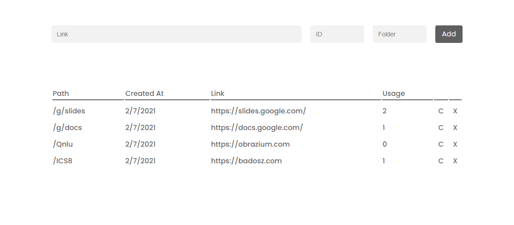

# Usbino
**U**RL **s**hortener, **b**ecause **I** **n**eeded **o**ne.

**Features**
-
* Customizable generation
* Creation date 
* Usage
* Folders
* Sorting

**Planned**
-
* Password protected links
* Expiration date 
* Editing
* Dark theme

**Run Locally**
-
1. Clone this repository
2. Create `shorts` table in your database ([RethinkDB](https://rethinkdb.com/))
3. Create `config.json` based on `config-example.json`
2. Run `npm install`
3. Run `tsc`
4. Run `node build/index.js`
